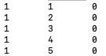

```{r setup, include=FALSE}
knitr::opts_chunk$set(echo = TRUE)
```

## Design  

To calculate the average coverage(sequencing depth) for the given sample BAM file, two approach are presented below.  

1. The first one is based on the coverage calculation equation:   
$$ C = \frac{LN}{G} $$
where 
 - $C$ is coverage.  
 - $G$ is the haploid genome length. 
 - $L$ is the read length in the sequencing. 
 - $N$ is the number of reads.
 
The ***samtool idxstats*** can be used to get chromosome lengths and number of mapped reads.

2. The second one is more precise. The ***samtool depth*** can be used to calculate the coverage at each genomic position and the average coverage of the given BAM file.  

3. At the end, two other tools ***bedtools genomecov*** and ***mosdepth*** are presented briefly in coverage calculation.   

### Download BAM file 

```{bash download, eval=FALSE}
cd ~
mkdir TakeHomeFulgent
cd TakeHomeFulgent
wget ftp://ftp.1000genomes.ebi.ac.uk/vol1/ftp/phase1/data/NA12878/exome_alignment/NA12878.mapped.illumina.mosaik.CEU.exome.20110411.bam
bam=NA12878.mapped.illumina.mosaik.CEU.exome.20110411.bam
```

### Quick estimate 

```{bash quick, eval=FALSE}
samtools idxstats $bam \
| awk -vreadlen=100 '
   {
       len += $2
       nreads += $3
   }
   END {
       print nreads * readlen / len
   }
   '
```

The average coverage of given BAM file is: **5.26501**.  

However, we don't have the information of the read length and a arbitrary number is used here so the estimation is not accurate.  

### Coverage calculation for each position 

**Step1:** calculate the coverage at each genomic position. 

```{bash samtools depth, eval=FALSE}
samtools depth -a $bam > NA12878_coverage.txt
```

Overlook the coverage output.   

```{bash samtools overlook, eval=FALSE}
head -n 5 NA12878_coverage.txt
```
    

  
Each line represents a genomic position. Three columns are included int he coverage output:   

- Chromosome;  
- Position;  
- Reads covered this position.   

**Step2:** calculate the average coverage. 

```{bash samtools average, eval=FALSE}
awk '{sum+=$3} END { print "Average coverage = ",sum/NR}' NA12878_coverage.txt
```

Average coverage = **3.64239**

**Alternative calculation:**  
The total length of the genome can also be calculated as below:  

```{bash samtools another1, eval=FALSE}
## @SQ is the reference sequence dictionary and LN in this line shows the reference sequence length. 
## So the $tot here represent the totle length of sample genome
tot=$(samtools view -H $bam | awk -vFS=: '/^@SQ/ {sum+=$3} END {print sum}')
echo $tot
# 3101804739
```

Then the average coverage is calculated as below: 

```{bash samtools another2, eval=FALSE}
sum=$(awk '{sum+=$3} END {print sum}' NA12878_coverage.txt)
echo $sum
# 11297985096
avg=$(echo "$sum/$tot" | bc -l)
echo $avg
# 3.64239
printf "The average coverage is: %.5f\n" "$avg"
```

The average coverage is: **3.64**  

### Other methods  

1. ***bedtools genomecov -d*** also reports the genome coverage per base as below:  

```{bash bedtools, eval=FALSE}
# To use -ibam flag in bedtools genomecov, the bam file is needed to be sorted by position
samtools sort $bam | bedtools genomecov -ibam stdin -d > NA12878_genomecov.txt
```

Then the average coverage would be: 

```{bash bedtools_average, eval=FALSE}
awk '{sum+=$3} END { print "Average coverage = ",sum/NR}' NA12878_genomecov.txt
```

Average coverage = ****

2. ***mosdepth*** can report coverage for both per-base and summary result at the same time.

```{bash mosdepth, eval=FALSE}
mosdepth NA12878 $bam
```

It can also report coverage based on the user defined region by using ***--by <bed|window> ***. 

### Runing time comparison  

- *samtools depth* :  
- *bedtools genomecov* :   
- *mosdepth* :
